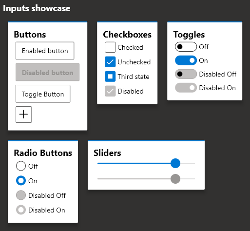

  <h1 align="center">fluent_ui</h1>
  

    
    
    
    
  

  

    
  

Implements Fluent UI to [Flutter](flutter.dev).
It's written based on the following documentations:

- https://docs.microsoft.com/en-us/windows/uwp/design/
- https://developer.microsoft.com/pt-br/fluentui#/controls/web

## Motivation

Since flutter has Windows support (currently in alpha as of 18/02/2021), it's necessary to have support to its UI guidelines to build apps with fidelity, since it has support for Material and Cupertino.
See [this](https://github.com/flutter/flutter/issues/46481) for more info on the offical fluent ui support

See also:

- [Material UI for Flutter](https://flutter.dev/docs/development/ui/widgets/material)
- [Cupertino UI for Flutter](https://flutter.dev/docs/development/ui/widgets/cupertino)

## Usage

To use this package, please [read the documentation](https://github.com/bdlukaa/fluent_ui/wiki)

### TODO:

(1) = High priority\
(2) = Medium priority\
(3) = Low priority

Basic Inputs:

- ✔️ [Button](https://docs.microsoft.com/en-us/windows/uwp/design/controls-and-patterns/buttons#create-a-button)
- ✔️ [Checkbox](https://docs.microsoft.com/en-us/windows/uwp/design/controls-and-patterns/checkbox)
- ✔️ [RadioButton](https://docs.microsoft.com/en-us/windows/uwp/design/controls-and-patterns/radio-button)
- ✔️ [Slider](https://docs.microsoft.com/en-us/windows/uwp/design/controls-and-patterns/slider)
- ✔️ [ToggleButton](https://docs.microsoft.com/en-us/uwp/api/windows.ui.xaml.controls.primitives.togglebutton?view=winrt-19041)
- ✔️ [ToggleSwitch](https://docs.microsoft.com/en-us/windows/uwp/design/controls-and-patterns/toggles)
- (3) [DropDownButton](https://docs.microsoft.com/en-us/windows/uwp/design/controls-and-patterns/buttons#example---drop-down-button)
- (3) [SplitButton](https://docs.microsoft.com/en-us/windows/uwp/design/controls-and-patterns/buttons#example---split-button)
- (2) [ComboBox](https://docs.microsoft.com/en-us/windows/uwp/design/controls-and-patterns/combo-box)
- (3) [RatingControl](https://docs.microsoft.com/en-us/windows/uwp/design/controls-and-patterns/rating)
- (1) [Forms](https://docs.microsoft.com/en-us/windows/uwp/design/controls-and-patterns/forms)

[Overlays](https://docs.microsoft.com/en-us/windows/uwp/design/controls-and-patterns/dialogs-and-flyouts/):
- (1) [Dialogs](https://docs.microsoft.com/en-us/windows/uwp/design/controls-and-patterns/dialogs-and-flyouts/dialogs)
- (3) [Flyouts](https://docs.microsoft.com/en-us/windows/uwp/design/controls-and-patterns/dialogs-and-flyouts/flyouts)
- (3) [Teaching tip](https://docs.microsoft.com/en-us/windows/uwp/design/controls-and-patterns/dialogs-and-flyouts/teaching-tip)
- (2) [Tooltip](https://docs.microsoft.com/en-us/windows/uwp/design/controls-and-patterns/tooltips)

[Navigation](https://docs.microsoft.com/en-us/windows/uwp/design/controls-and-patterns/master-details):

- (1) [Navigation View](https://docs.microsoft.com/en-us/windows/uwp/design/controls-and-patterns/navigationview)
- (1) [Pivot](https://docs.microsoft.com/en-us/windows/uwp/design/controls-and-patterns/pivot)
- [TabView](https://docs.microsoft.com/en-us/windows/uwp/design/controls-and-patterns/tab-view)

Pickers:
- (3) [Date and time](https://docs.microsoft.com/en-us/windows/uwp/design/controls-and-patterns/date-and-time)
- (3) [Calendar date picker](https://docs.microsoft.com/en-us/windows/uwp/design/controls-and-patterns/calendar-date-picker)
- (3) [Calendar view](https://docs.microsoft.com/en-us/windows/uwp/design/controls-and-patterns/calendar-view)
- (2) [Date picker](https://docs.microsoft.com/en-us/windows/uwp/design/controls-and-patterns/date-picker)
- (2) [Time picker](https://docs.microsoft.com/en-us/windows/uwp/design/controls-and-patterns/time-picker)

Others:

- (1) [Progress indicators](https://docs.microsoft.com/en-us/windows/uwp/design/controls-and-patterns/progress-controls)
- (3) [Info bar](https://docs.microsoft.com/en-us/windows/uwp/design/controls-and-patterns/infobar)
- (3) [Badges](https://docs.microsoft.com/en-us/windows/uwp/design/shell/tiles-and-notifications/badges)
- (3) [Sound](https://docs.microsoft.com/en-us/windows/uwp/design/style/sound)
- (3) [Contact card](https://docs.microsoft.com/en-us/windows/uwp/design/controls-and-patterns/contact-card)
- (3) [Flip View](https://docs.microsoft.com/en-us/windows/uwp/design/controls-and-patterns/flipview)
- (3) [Tree View](https://docs.microsoft.com/en-us/windows/uwp/design/controls-and-patterns/tree-view)
- (3) [Pull to refresh](https://docs.microsoft.com/en-us/windows/uwp/design/controls-and-patterns/pull-to-refresh)

# Contribution

Feel free to [open an issue](https://github.com/bdlukaa/fluent_ui/issues/new) if you find an error or [make pull requests](https://github.com/bdlukaa/fluent_ui/pulls).