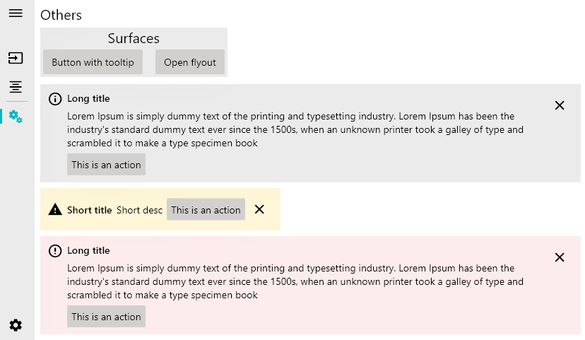
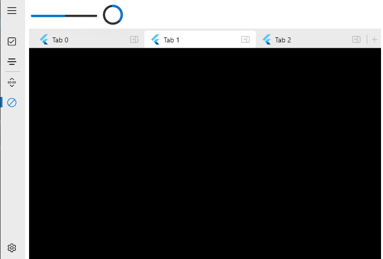

<div>
  <h1 align="center">fluent_ui</h1>
  <p align="center" >
    <a title="Discord" href="https://discord.gg/674gpDQUVq">
      
    </a>
    <a title="Pub" href="https://pub.dartlang.org/packages/fluent_ui" >
      
    </a>
    <a title="Github License">
      
    </a>
    <a title="PRs are welcome">
      
    </a>
  </p>
  <p align="center">
    <a title="Buy me a coffee" href="https://www.buymeacoffee.com/bdlukaa">
      
    </a>
  </p>
  <p align="center">
  Design beautiful native windows apps using Flutter
  </p>
</div>

Unofficial implementation of Fluent UI for [Flutter](flutter.dev). It's written based on the [official documentation](https://docs.microsoft.com/en-us/windows/uwp/design/)

### Content

- [Motivation](#motivation)
  - [Roadmap](#roadmap)
- [Style](#style)
  - [Icons](#icons)
  - [Colors](#colors)
  - [Accent color](#accent-color)
  - [Brightness](#brightness)
  - [Typograpy](#typography)
    - [Font](#font)
    - [Type ramp](#type-ramp)
- **TODO** [Accessibility]()
- [Navigation](#navigation)
  - [Navigation panel](#navigation-panel)
  - **TODO** [Pivot]()
  - [Tab View](#tab-view)
- [Widgets](#widgets)
  - [Button](#button)
  - [Split Button](#split-button)
  - [Toggle Button](#toggle-button)
  - **TODO** [Dropdown Button]()
  - [Checkbox](#checkbox)
  - [Toggle Switches](#toggle-switches)
  - [Radio Buttons](#radio-buttons)
  - [Slider](#slider)
  - [TextBox](#textbox)
  - **TODO** [Auto Suggest Box]()
  - **TODO** [Combo Box]()
  - [Tooltip](#tooltip)
  - [Content Dialog](#content-dialog)
  - **TODO** Flyout
  - **TODO** Teaching tip
  - [Acrylic](#acrylic)
  - [InfoBar](#infobar)
  - **TODO** [Calendar View]()
  - **TODO** [Calendar Date Picker]()
  - **TODO** [Date Picker]()
  - **TODO** [Time Picker]()
  - [Progress Bar and Progress Ring](#progress-bar-and-progress-ring)
  - **TODO** [Pull-to-Refresh]()
  - **TODO** [Tree View]()
  - [ListTile](#list-tile)
- [Equivalents with the material library](#equivalents-with-the-material-library)
- [Contribution](#contribution)

## Motivation

Since flutter has Windows support (currently in stable under an early release flag as of 11/03/2021), it's necessary to have support to its UI guidelines to build apps with fidelity, since it has support for Material and Cupertino.
See [this](https://github.com/flutter/flutter/issues/46481) for more info on the offical fluent ui support

See also:

- [Material UI for Flutter](https://flutter.dev/docs/development/ui/widgets/material)
- [Cupertino UI for Flutter](https://flutter.dev/docs/development/ui/widgets/cupertino)

### Roadmap

Currently, we've only done the desktop part of the library, so you can import the library as one itself:

```dart
import 'package:fluent_ui/fluent_ui';
```

Note: this does not mean you can't use this library anywhere else. You can use it wherever you want

Futurely, once the desktop part of this library gets mature, web and mobile will also be supported. See also:

- [Fluent UI Windows](https://docs.microsoft.com/en-us/windows/uwp/design/)
- [Fluent UI Web](https://developer.microsoft.com/pt-br/fluentui#/controls/web)
- [Fluent UI iOS](https://developer.microsoft.com/pt-br/fluentui#/controls/ios)
- [Fluent UI Android](https://developer.microsoft.com/pt-br/fluentui#/controls/android)
- [Fluent UI macOS](https://developer.microsoft.com/pt-br/fluentui#/controls/mac)

Also, futurely there will be a way to get the current device accent color. For more info, see [accent color](#accent-color)

---





# Style

[Learn more about Fluent Style](https://docs.microsoft.com/en-us/windows/uwp/design/style/)

You can use the `Theme` widget to, well... theme your widgets. You can style your widgets in two ways:

1. Using the `FluentApp` widget

```dart
FluentApp(
  title: 'MyApp',
  style: Style(
    ...
  ),
)
```

2. Using the `Theme` widget

```dart
Theme(
  style: Style(
    ...
  ),
  child: ...,
),
```

## Icons


Inside your app, you use icons to represent an action, such as copying text or navigating to the settings page. This library includes an icon library with it, so you can just call `Icons.[icon_name]` in any `Icon` widget:

```dart
Icon(Icons.add)
```

To style icons, you can use `IconStyle` in the app `Style` or use the property `style` in the `Icon` widget. You can see the list of icons [here](https://github.com/microsoft/fluentui-system-icons/blob/master/icons.md)


## Colors

This library also includes the Fluent UI colors with it, so you can just call `Colors.[color_name]`:

```dart
TextStyle(color: Colors.black)
```

Avaiable colors:

- `Colors.transparent`
- `Colors.white`
- `Colors.black`
- `Colors.grey`
- `Colors.yellow`
- `Colors.orange`
- `Colors.red`
- `Colors.magenta`
- `Colors.purple`
- `Colors.blue`
- `Colors.teal`
- `Colors.green`

### Accent color

Common controls use an accent color to convey state information. By default, the accent color is `Colors.blue`. However, you can also customize your app's accent color to reflect your brand:

```dart
Style(
  accentColor: Colors.blue,
)
```

[Learn more](https://docs.microsoft.com/en-us/windows/uwp/design/style/color#accent-color)

## Brightness

You can change the style brightness to change the color of your app.

1. `Brightness.light`
   
2. `Brightness.dark`
   

It defaults to the brightness of the device. (`MediaQuery.of(context).brightness`)

## Typography

To set a typography, you can use the `Style` class combined with the `Typography` class:

```dart
Style(
  typography: Typography(
    caption: TextStyle(
      fontSize: 12,
      color: Colors.black,
      fontWeight: FontWeight.normal,
    ),
  ),
)
```

### Font

You should use one font throughout your app's UI, and we recommend sticking with the default font for Windows apps, **Segoe UI**. It's designed to maintain optimal legibility across sizes and pixel densities and offers a clean, light, and open aesthetic that complements the content of the system.


[Learn more](https://docs.microsoft.com/en-us/windows/uwp/design/style/typography#font)

### Type ramp

The Windows type ramp establishes crucial relationships between the type styles on a page, helping users read content easily.


[Learn more](https://docs.microsoft.com/en-us/windows/uwp/design/style/typography#type-ramp)

# Navigation

The default flutter navigation is available when using the `FluentApp` widget, that means you can simply call `Navigator.push` and `Navigator.pop` to navigate between routes. See [navigate to a new screen and back](https://flutter.dev/docs/cookbook/navigation/navigation-basics)

## Navigation panel

> Navigation Panel will be rewritten in a near future. See [#3](https://github.com/bdlukaa/fluent_ui/issues/3) for more info

```dart
int _currentIndex = 0;

Scaffold(
  left: NavigationPanel(
    currentIndex: _currentIndex,
    menu: NavigationPanelMenuItem(...),
    items: [
      NavigationPanelSectionHeader(
        header: Text('Cool Navigation Panel Header'),
      ),
      NavigationPanelItem(
        icon: Icon(Icons.checkbox_checked),
        label: Text('Page 1'),
        onTapped: () => setState(() => _currentIndex = 0),
      ),
      NavigationPanelTileSeparator(),
      NavigationPanelItem(
        icon: Icon(Icons.text_align_center_filled),
        label: Text('Page 2'),
        onTapped: () => setState(() => _currentIndex = 1),
      ),
    ],
  ),
  body: ...,
)
```


### Navigation body

Usually used in Scaffold's `body` property. Example:

```dart
int _currentIndex = 0;

Scaffold(
  left: NavigationPanel(...),
  body: NavigationPanelBody(
    index: _currentIndex,
    transitionBuilder: (child, animation) {
      // Refer to page transitions to see more page transitions
      return DrillInPageTransition(
        child: child,
        animation: animation,
      );
    }
    children: [
      Page1(),
      Page2(),
    ],
  ),
),
```

### Page transitions

Page transitions navigate users between pages in an app, providing feedback as the relationship between pages. Page transitions help users understand if they are at the top of a navigation hierarchy, moving between sibling pages, or navigating deeper into the page hierarchy.

This library gives you the following implementations to navigate between your pages:

#### Entrance

Entrance is a combination of a slide up animation and a fade in animation for the incoming content. Use entrance when the user is taken to the top of a navigational stack, such as navigating between tabs or left-nav items.

The desired feeling is that the user has started over.

Avaiable with the widget `EntrancePageTransition`, it produces the following effect:


#### Drill In

Use drill when users navigate deeper into an app, such as displaying more information after selecting an item.

The desired feeling is that the user has gone deeper into the app.

Avaiable with the widget `DrillInPageTransition`, it produces the following effect:


#### Horizontal

It's avaiable with the widget `HorizontalSlidePageTransition`.

It's recommended to widely use these transitions when using the navigation panel.

## Tab View

The TabView control is a way to display a set of tabs and their respective content. TabViews are useful for displaying several pages (or documents) of content while giving a user the capability to rearrange, open, or close new tabs. [Learn more](https://docs.microsoft.com/en-us/windows/uwp/design/controls-and-patterns/tab-view)

### Example

```dart
SizedBox(
  height: 600,
  child: TabView(
    currentIndex: currentIndex,
    onChanged: (index) => setState(() => currentIndex = index),
    onNewPressed: () {
      setState(() => tabs++);
    },
    tabs: List.generate(tabs, (index) {
      return Tab(
        text: Text('Tab $index'),
        closeIcon: Tooltip(
          message: 'Close tab',
          child: IconButton(
            icon: Icon(Icons.pane_close),
            onPressed: () {
              setState(() => tabs--);
              if (currentIndex > tabs - 1) currentIndex--;
            },
          ),
        ),
      );
    }),
    bodies: List.generate(
      tabs,
      (index) => Container(
        color: index.isEven ? Colors.red : Colors.yellow,
      ),
    ),
  ),
),
```

The code above produces the following:


# Widgets:

## Button

A button gives the user a way to trigger an immediate action. [Learn more](https://docs.microsoft.com/en-us/windows/uwp/design/controls-and-patterns/buttons)

### Creating

```dart
Button(
  text: Text('Cool button'),
  onPressed: () {
    print('button pressed'),
  }
)
```

To disable the button, set `onPressed` to `null`

### Screenshots

\
\


## Split Button

A Split Button has two parts that can be invoked separately. One part behaves like a standard button and invokes an immediate action. The other part invokes a flyout that contains additional options that the user can choose from. [Learn more](https://docs.microsoft.com/en-us/windows/uwp/design/controls-and-patterns/buttons#create-a-split-button)

You can use a `SplitButtonBar` to create a Split Button. It usually takes `Button`s in the `buttons` property. You can also customize the button spacing by changing the property `interval` in its style.

### Example

```dart
const double splitButtonHeight = 50.0;

SplitButtonBar(
  style: SplitButtonStyle(
    interval: 1, // the default value is one
  ),
  // There need to be at least 2 items in the buttons, and they must be non-null
  buttons: [
    SizedBox(
      height: splitButtonHeight,
      child: Button(
        text: Container(
          height: 24,
          width: 24,
          color: context.theme!.accentColor,
        ),
        onPressed: () {},
      ),
    ),
    SizedBox(
      height: splitButtonHeight,
      child: Button(
        text: Icon(Icons.chevron_down),
        onPressed: () {
          // TODO: open the color list here
        },
        style: ButtonStyle(padding: EdgeInsets.all(6)),
      )
    )
  ],
)
```

The code above produces the following button:


## Toggle Button

A button that can be on or off.

### Example

```dart
bool _value = false;

ToggleButton(
  child: Text('Toggle Button'),
  checked: _value,
  onChanged: (value) => setState(() => _value = value),
)
```

## Checkbox

A check box is used to select or deselect action items. It can be used for a single item or for a list of multiple items that a user can choose from. The control has three selection states: unselected, selected, and indeterminate. Use the indeterminate state when a collection of sub-choices have both unselected and selected states. [Learn more](https://docs.microsoft.com/en-us/windows/uwp/design/controls-and-patterns/checkbox)

### Creating

To create a checkbox, use the widget `Checkbox`:

```dart
bool _checked = true;

Checkbox(
  checked: _checked,
  onChanged: (value) => setState(() => _checked = value),
)
```

#### Handling its states

| State         | Property  | Value    |
| ------------- | --------- | -------- |
| checked       | checked   | `true`   |
| unchecked     | checked   | `false`  |
| indeterminate | checked   | `null`   |
| enabled       | onChanged | non-null |
| disabled      | onChanged | `null`   |

### Screenshots


## Toggle Switches

The toggle switch represents a physical switch that allows users to turn things on or off, like a light switch. Use toggle switch controls to present users with two mutually exclusive options (such as on/off), where choosing an option provides immediate results.

### Example

```dart
bool _checked = false;

ToggleSwitch(
  checked: _checked,
  onChanged: (v) => setState(() => _checked = v),
)
```


| Toggle Switch                                                                                                  | Checkbox                                                                                                                                                                                |
| -------------------------------------------------------------------------------------------------------------- | --------------------------------------------------------------------------------------------------------------------------------------------------------------------------------------- |
| Use a toggle switch for binary settings when changes become effective immediately after the user changes them. | Use check boxes for optional ("nice to have") items.                                                                                                                                    |
|                                                                                                                | Use a checkbox when the user has to perform extra steps for changes to be effective. For example, if the user must click a "submit" or "next" button to apply changes, use a check box. |
|                                                                                                                | Use check boxes when the user can select multiple items that are related to a single setting or feature.                                                                                |

## Radio Buttons

Radio buttons, also called option buttons, let users select one option from a collection of two or more mutually exclusive, but related, options. Radio buttons are always used in groups, and each option is represented by one radio button in the group.

In the default state, no radio button in a RadioButtons group is selected. That is, all radio buttons are cleared. However, once a user has selected a radio button, the user can't deselect the button to restore the group to its initial cleared state.

The singular behavior of a RadioButtons group distinguishes it from check boxes, which support multi-selection and deselection, or clearing.

[Learn more](https://docs.microsoft.com/en-us/windows/uwp/design/controls-and-patterns/radio-button)

### Example

```dart
int _currentIndex = -1;

final radioButtons = [
  'RadioButton 1',
  'RadioButton 2',
  'RadioButton 3',
];

Column(
  children: List.generate(radioButtons.length, (index) {
    return Row(children: [
      RadioButton(
        selected: _currentIndex == index,
        // set onChanged to null to disable the button
        onChanged: () => setState(() => _currentIndex = index),
      ),
      SizedBox(width: 4),
      Text(radioButtons[index])
    ]);
  }),
),
```

The code above produces the following:


- [Is this the right control for you?](https://docs.microsoft.com/en-us/windows/uwp/design/controls-and-patterns/radio-button#is-this-the-right-control)

### Screenshots


## Slider

A slider is a control that lets the user select from a range of values by moving a thumb control along a track. [Learn more](https://docs.microsoft.com/en-us/windows/uwp/design/controls-and-patterns/slider)

- [Is this the right control for you?](https://docs.microsoft.com/en-us/windows/uwp/design/controls-and-patterns/slider#is-this-the-right-control)
- [Recommendations](https://docs.microsoft.com/en-us/windows/uwp/design/controls-and-patterns/slider#recommendations)

> Vertical slider is not available yet

### Example

```dart
double _value = 0;

Container(
  // The default width is 200.
  // The slider does not have its own widget, so you have to add it yourself.
  // The slider always try to be as big as possible
  width: 200,
  child: Slider(
    max: 100,
    value: _value,
    onChanged: (v) => setState(() => value = v),
    // Label is the text displayed above the slider when the user is interacting with it.
    label: '${sliderValue.toInt()}',
  ),
)
```

The code above produces the following:


## Rating Bar

> The property `starSpacing` is missing

The rating control allows users to view and set ratings that reflect degrees of satisfaction with content and services. [Learn more](https://docs.microsoft.com/en-us/windows/uwp/design/controls-and-patterns/rating)

### Example

```dart
double rating = 0.0;

RatingBar(
  rating: rating,
  onChanged: (v) => setState(() => rating = v),
)
```

You can set `amount` to change the amount of stars. The `rating` must be less than the stars and more than 0. You can also change the `icon`, its size and color. You can make the bar read only by setting `onChanged` to `null`.


## TextBox

The TextBox control lets a user type text into an app. It's typically used to capture a single line of text, but can be configured to capture multiple lines of text. The text displays on the screen in a simple, uniform, plaintext format. [Learn more](https://docs.microsoft.com/en-us/windows/uwp/design/controls-and-patterns/text-box)

You can use the [forms screen](example/lib/screens/forms.dart) in the example app for reference.

### Creating

You can use the widget `TextBox` to create text boxes:

```dart
TextBox(
  controller: ...,
  header: 'Notes',
  placeholder: 'Type your notes here',
),
```

### Screenshots

\
\
\


## Tooltip

A tooltip is a short description that is linked to another control or object. Tooltips help users understand unfamiliar objects that aren't described directly in the UI. They display automatically when the user moves focus to, presses and holds, or hovers the mouse pointer over a control. The tooltip disappears after a few seconds, or when the user moves the finger, pointer or keyboard/gamepad focus. [Learn more](https://docs.microsoft.com/en-us/windows/uwp/design/controls-and-patterns/images/controls/tool-tip.png)

### Creating

To add a tooltip to a widget, wrap it in a `Tooltip` widget:

```dart
Tooltip(
  message: 'Tooltip message hehe',
  child: Button(
    text: Text('Button with tooltip'),
    onPressed: () {
      print('pressed button with tooltip');
    }
  ),
)
```

It's located above or below the `child` widget. You can specify the preffered location when both locations are available using the `preferBelow` property.

### Screenshots


## Content Dialog

Dialogs are modal UI overlays that provide contextual app information. They block interactions with the app window until being explicitly dismissed. They often request some kind of action from the user. [Learn more](https://docs.microsoft.com/en-us/windows/uwp/design/controls-and-patterns/dialogs-and-flyouts/dialogs)

### Creating

You can create a Dialog with the widget `ContentDialog`:

```dart
ContentDialog(
  title: Text('No WiFi connection'),
  content: Text('Check your connection and try again'),
  actions: [
    Button(
      text: Text('Ok'),
      onPressed: () {
        Navigator.pop(context);
      }
    )
  ],
),
```

### Display

You can display the dialog as an overlay by calling the function `showDialog`:

```dart
showDialog(
  context: context,
  builder: (context) {
    return ContentDialog(...);
  },
);
```

### Screenshots

\
\
\
\


[Navigation](https://docs.microsoft.com/en-us/windows/uwp/design/controls-and-patterns/master-details):

## Acrylic

Acrylic is a type of Brush that creates a translucent texture. You can apply acrylic to app surfaces to add depth and help establish a visual hierarchy.

#### Usage

You can easily use the `Acrylic` widget as a substitute for the `Container`, because it has all the necessary properties it has, but don't use it everywhere everytime:

| Do                                                                                                                                  | Don't                                                                                                                                                     |
| ----------------------------------------------------------------------------------------------------------------------------------- | --------------------------------------------------------------------------------------------------------------------------------------------------------- |
| Do use acrylic as the background material of non-primary app surfaces like navigation panes.                                        | Don't put desktop acrylic on large background surfaces of your app - this breaks the mental model of acrylic being used primarily for transient surfaces. |
| Do extend acrylic to at least one edge of your app to provide a seamless experience by subtly blending with the app’s surroundings. | Don’t place in-app and background acrylics directly adjacent to avoid visual tension at the seams.                                                        |
|                                                                                                                                     | Don't place multiple acrylic panes with the same tint and opacity next to each other because this results in an undesirable visible seam.                 |
|                                                                                                                                     | Don’t place accent-colored text over acrylic surfaces.                                                                                                    |

```dart
Acrylic(
  padding: EdgeInsets.all(12), // Defaults to EdgeInsets.zero
  child: Button(
    text: Text('Mom it\'s me hehe <3'),
    onPressed: () {
      print('button inside acrylic pressed');
    }
  ),
  color: ...,
  width: ...,
  height: ...,
),
```

### Widgets using Acrylic

Currently, the following widgets use acrylic in its implementation:

- [InfoBar](#infobar)
- [Navigation Panel](#navigation-panel)

> This widget MAY BE unperformatic on VERY OLD devices because it uses expensive widgets in its composition: `ClipRect` and `BackdropFilter`. It should not affect the most part of the devices

### Screenshots


## InfoBar

The `InfoBar` widget is for displaying app-wide status messages to users that are highly visible yet non-intrusive. There are built-in Severity levels to easily indicate the type of message shown as well as the option to include your own call to action or hyperlink button. Since the InfoBar is inline with other UI content the option is there for the control to always be visible or dismissed by the user.

#### Usage

You can easility create it using the `InfoBar` widget and theme it using `InfoBarStyle`. It has built-in support for both light and dark theme:

```dart
InfoBar(
  title: Text('Update available'),
  content: Text('Restart the app to apply the latest update.'), // optional
  severity: InfoBarSeverity.info, // optional. Default to InfoBarSeverity.info
),
```

#### Some screenshots

\
\
\
\
\


## Progress Bar and Progress Ring

A progress control provides feedback to the user that a long-running operation is underway. It can mean that the user cannot interact with the app when the progress indicator is visible, and can also indicate how long the wait time might be, depending on the indicator used.

### Example

Creating a ProgressBar:

```dart
ProgressBar(value: 35)
```


You can omit the `value` property to create an indeterminate progress bar:


Indeterminate Progress Bar is a courtesy of [@raitonubero](https://github.com/raitonoberu). Show him some love

Creating a ProgressRing:

```dart
ProgressRing(value: 35)
```


You can omit the `value` property to create an indeterminate progress ring:


Both Indeterminate ProgressBar and Indeterminate ProgressRing is a courtesy of [@raitonubero](https://github.com/raitonoberu). Show him some love ❤

### Screenshots


## ListTile

You can use a `ListTile` in a `ListView`.

### Example

```dart
final people = {
  'Mass in B minor': 'Johann Sebastian Bach',
  'Third Symphony': 'Ludwig van Beethoven',
  'Serse': 'George Frideric Hendel',
};

ListView.builder(
  itemCount: people.length,
  itemBuilder: (context, index) {
    final title = people.keys[index];
    final subtitle = people[title];
    return ListTile(
      leading: CircleAvatar(),
      title: Text(title),
      subtitle: Text(subtitle),
    );
  }
),
```

The code above produces the following:


### Screenshots

\
\


---

### Equivalents with the material library

The list of equivalents between this library and `flutter/material.dart`

| Material                  | Fluent          |
| ------------------------- | --------------- |
| TextButton                | Button          |
| IconButton                | IconButton      |
| Checkbox                  | Checkbox        |
| RadioButton               | RadioButton     |
| -                         | RatingBar       |
| -                         | SplitButton     |
| -                         | ToggleButton    |
| Switch                    | ToggleSwitch    |
| TextField                 | TextBox         |
| AlertDialog               | ContentDialog   |
| MaterialBanner            | InfoBar         |
| Tooltip                   | Tooltip         |
| Drawer                    | NavigationPanel |
| Divider                   | Divider         |
| VerticalDivider           | Divider         |
| Card                      | Acrylic         |
| ListTile                  | ListTile        |
| LinearProgressIndicator   | ProgressBar     |
| CircularProgressIndicator | ProgressRing    |

## Contribution

Feel free to [open an issue](https://github.com/bdlukaa/fluent_ui/issues/new) if you find an error or [make pull requests](https://github.com/bdlukaa/fluent_ui/pulls).

All the widgets above with the mark of (3) will not be implemented soon, so you can create a pull request with the implementation for them :). You can also help to improve the documentation for all the widgets, and in this readme.

All type of contributions are welcome :)
