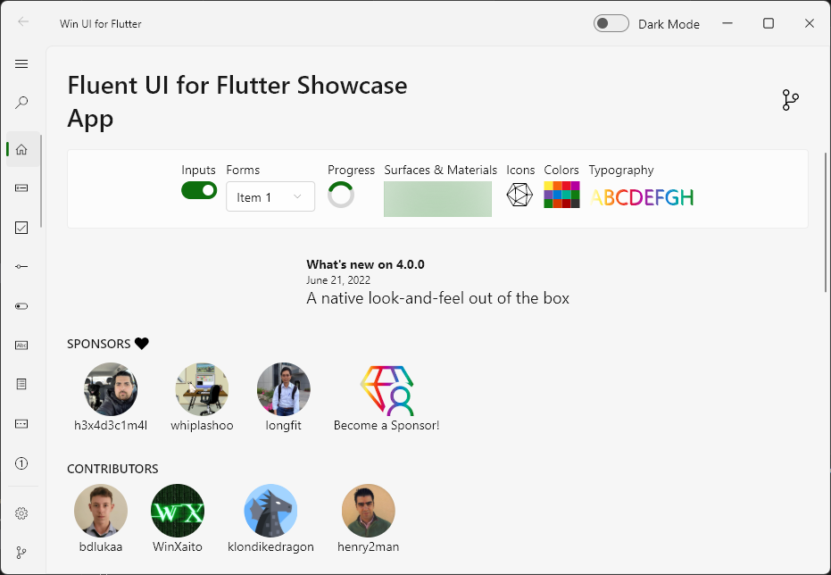

<div align="center">
  <h1>fluent_ui</h1>
  <div>
    <a title="pub.dev" href="https://pub.dartlang.org/packages/fluent_ui" >
      
    </a>
    <a title="GitHub License" href="https://github.com/bdlukaa/fluent_ui/blob/master/LICENSE">
      
    </a>
    <a title="Made with Fluent Design" href="https://github.com/bdlukaa/fluent_ui">
      
    </a>
    <a title="Discord" href="https://discord.gg/674gpDQUVq">
      
    </a>
  </div>
  <div>
    <a title="Web Example" href="https://bdlukaa.github.io/fluent_ui">
      
    </a>
  </div>
  <br/>
  <p>
  Design beautiful native Windows apps using <a href="https://flutter.dev">Flutter</a>
  </p>

  <p>
  Unofficial implementation of Fluent UI for <a href="https://flutter.dev">Flutter</a>. It's written based on the <a href="https://docs.microsoft.com/en-us/windows/uwp/design">official documentation</a>.
  </p>
</div>

<div align="center">
  <a href="https://bdlukaa.github.io/fluent_ui">
    
  </a>
</div>

---

### Content

- [Motivation](#motivation)
- [Installation](#installation)
  - [Badge](#badge)
- [Style](#style)
  - [Icons](#icons)
  - [Colors](#colors)
    - [Accent color](#accent-color)
  - [Brightness](#brightness)
  - [Visual Density](#visual-density)
  - [Typograpy](#typography)
    - [Font](#font)
    - [Type ramp](#type-ramp)
  - [Reveal Focus](#reveal-focus)
- [Navigation](#navigation)
  - [Bottom Navigation](#bottom-navigation)
- [Widgets](#widgets)
  - [Tooltip](#tooltip)
  - [Content Dialog](#content-dialog)
  - [Expander](#expander)
  - [Flyout](#flyout)
  - **TODO** [Teaching tip]()
  - [Acrylic](#acrylic)
  - [InfoBar](#infobar)
  - **TODO** [Calendar View](#calendar-view)
  - **TODO** [Calendar Date Picker]()
  - [Progress Bar and Progress Ring](#progress-bar-and-progress-ring)
  - [Scrollbar](#scrollbar)
  - [ListTile](#listtile)
  - [Info Label](#info-label)
  - [CommandBar](#commandbar)
- [Mobile Widgets](#mobile-widgets)
  - [Chip](#chip)
  - [Pill Button Bar](#pill-button-bar)
  - [Snackbar](#snackbar)
- [Layout Widgets](#layout-widgets)
  - [DynamicOverflow](#dynamicoverflow)
- [Equivalents with the material library](#equivalents-with-the-material-library)
- [Localization](#Localization)
- [Contribution](#contribution)
  - [Contributing new localizations](#contributing-new-localizations)
  - [Acknowledgements](#acknowledgements)

## Motivation

Since Flutter has stable Windows support, it's necessary to have support to its UI guidelines to build apps with fidelity, the same way it has support for Material and Cupertino.
See [this](https://github.com/flutter/flutter/issues/46481) for more info on the offical fluent ui support

See also:

- [Material UI for Flutter](https://flutter.dev/docs/development/ui/widgets/material)
- [Cupertino UI for Flutter](https://flutter.dev/docs/development/ui/widgets/cupertino)
- [MacOS UI for Flutter](https://github.com/GroovinChip/macos_ui)

## Installation

Add the package to your dependencies:

```yaml
dependencies:
  fluent_ui: ^3.10.0
```

<p align="center">OR</p>

```yaml
dependencies:
  fluent_ui:
    git: https://github.com/bdlukaa/fluent_ui.git
```

You can see the example app [here](https://bdlukaa.github.io/fluent_ui//)

Finally, run `dart pub get` to download the package.

Projects using this library should use the stable channel of Flutter

### Badge

Are you using this library on your app? You can use a badge to tell others:

<a title="Made with Fluent Design" href="https://github.com/bdlukaa/fluent_ui">
  
</a>

Add the following code to your `README.md` or to your website:

```html
<a title="Made with Fluent Design" href="https://github.com/bdlukaa/fluent_ui">
  
</a>
```

---

# Style

[Learn more about Fluent Style](https://docs.microsoft.com/en-us/windows/uwp/design/style/)

You can use the `FluentTheme` widget to, well... theme your widgets. You can style your widgets in two ways:

1. Using the `FluentApp` widget

```dart
FluentApp(
  title: 'MyApp',
  theme: ThemeData(
    ...
  ),
)
```

2. Using the `FluentTheme` widget

```dart
FluentTheme(
  theme: ThemeData(
    ...
  ),
  child: ...,
),
```

## Icons


Inside your app, you use icons to represent an action, such as copying text or navigating to the settings page. This library includes an icon library with it, so you can just call `FluentIcons.[icon_name]` in any `Icon` widget:

```dart
Icon(FluentIcons.add),
```

For a complete reference of current icons, please check the [online demo](https://bdlukaa.github.io/fluent_ui/) and click on "Icons".

The online demo has a search box and also supports clipboard copy in order to find every icon as fast as possible.


## Colors

This library also includes the Fluent UI colors with it, so you can just call `Colors.[color_name]`:

```dart
TextStyle(color: Colors.black),
```

Avaiable colors:

- `Colors.transparent`
- `Colors.white`
- `Colors.black`
- `Colors.grey`
- `Colors.yellow`
- `Colors.orange`
- `Colors.red`
- `Colors.magenta`
- `Colors.purple`
- `Colors.blue`
- `Colors.teal`
- `Colors.green`

### Accent color

Common controls use an accent color to convey state information. [Learn more](https://docs.microsoft.com/en-us/windows/uwp/design/style/color#accent-color).

By default, the accent color is `Colors.blue`. However, you can also customize your app's accent color to reflect your brand:

```dart
ThemeData(
  accentColor: Colors.blue,
)
```

To use the system's accent color, you can use the plugin [system_theme](https://pub.dev/packages/system_theme) made by me :). It has support for (as of 04/01/2021) Android, Web and Windows.

```dart
import 'package:system_theme/system_theme.dart';

ThemeData(
  accentColor: SystemTheme.accentInstance.accent.toAccentColor(),
)
```

## Brightness

You can change the theme brightness to change the color of your app to

1. `Brightness.light`

   

2. `Brightness.dark`

   

It defaults to the brightness of the device. (`MediaQuery.of(context).platformBrightness`)

```dart
ThemeData(
  brightness: Brightness.light, // or Brightness.dark
),
```

## Visual Density

Density, in the context of a UI, is the vertical and horizontal "compactness" of the components in the UI. It is unitless, since it means different things to different UI components.

The default for visual densities is zero for both vertical and horizontal densities. It does not affect text sizes, icon sizes, or padding values.

For example, for buttons, it affects the spacing around the child of the button. For lists, it affects the distance between baselines of entries in the list. For chips, it only affects the vertical size, not the horizontal size.

```dart
ThemeData(
  visualDensity: VisualDensity.adaptivePlatformDensity,
),
```

The following widgets make use of visual density:

- Chip
- PillButtonBar
- Snackbar

## Typography

To set a typography, you can use the `ThemeData` class combined with the `Typography` class:

```dart
ThemeData(
  typography: Typography(
    caption: TextStyle(
      fontSize: 12,
      color: Colors.black,
      fontWeight: FontWeight.normal,
    ),
  ),
)
```

### Font

You should use one font throughout your app's UI, and we recommend sticking with the default font for Windows apps, **Segoe UI Variable**. It's designed to maintain optimal legibility across sizes and pixel densities and offers a clean, light, and open aesthetic that complements the content of the system. [Learn more](https://docs.microsoft.com/en-us/windows/apps/design/style/typography#font)


### Type ramp

The Windows type ramp establishes crucial relationships between the type styles on a page, helping users read content easily. All sizes are in effective pixels. [Learn more](https://docs.microsoft.com/en-us/windows/apps/design/style/typography#type-ramp)


## Reveal Focus

Reveal Focus is a lighting effect for [10-foot experiences](https://docs.microsoft.com/en-us/windows/uwp/design/devices/designing-for-tv), such as Xbox One and television screens. It animates the border of focusable elements, such as buttons, when the user moves gamepad or keyboard focus to them. It's turned off by default, but it's simple to enable. [Learn more](https://docs.microsoft.com/en-us/windows/uwp/design/style/reveal-focus)

Reveal Focus calls attention to focused elements by adding an animated glow around the element's border:


This is especially helpful in 10-foot scenarios where the user might not be paying full attention to the entire TV screen.

### Enabling it

Reveal Focus is off by default. To enable it, change the `focusTheme` in your app `ThemeData`:

```dart
theme: ThemeData(
  focusTheme: FocusThemeData(
    glowFactor: 4.0,
  ),
),
```

To enable it in a 10 foot screen, use the method `is10footScreen`:

```dart
import 'dart:ui' as ui;

theme: ThemeData(
  focusTheme: FocusThemeData(
    glowFactor: is10footScreen(ui.window.physicalSize.width) ? 2.0 : 0.0,
  ),
),
```

Go to the [example](/example) project to a full example

### Why isn't Reveal Focus on by default?

As you can see, it's fairly easy to turn on Reveal Focus when the app detects it's running on 10 foot screen. So, why doesn't the system just turn it on for you? Because Reveal Focus increases the size of the focus visual, which might cause issues with your UI layout. In some cases, you'll want to customize the Reveal Focus effect to optimize it for your app.

### Customizing Reveal Focus

You can customize the focus border, border radius and glow color:

```dart
focusTheme: FocusStyle(
  borderRadius: BorderRadius.zero,
  glowColor: theme.accentColor?.withOpacity(0.2),
  glowFactor: 0.0,
  border: BorderSide(
    width: 2.0,
    color: theme.inactiveColor ?? Colors.transparent,
  ),
),
```

To customize it to a single widget, wrap the widget in a `FocusTheme` widget, and change the options you want:

```dart
FocusTheme(
  data: FocusThemeData(...),
  child: Button(
    text: Text('Custom Focus Button'),
    onPressed: () {},
  )
),
```

# Navigation

The default Flutter Navigation is available on the `FluentApp` widget, that means you can simply call `Navigator.push` and `Navigator.pop` to navigate between routes. See [navigate to a new screen and back](https://flutter.dev/docs/cookbook/navigation/navigation-basics)

## Bottom Navigation

The bottom navigation displays icons and optional text at the bottom of the screen for switching between different primary destinations in an app. This is commomly used on small screens. [Learn more](https://developer.microsoft.com/pt-br/fluentui#/controls/android/bottomnavigation)

Here's an example of how to create a bottom navigation:

```dart
int index = 0;

ScaffoldPage(
  content: NavigationBody(index: index, children: [
    Container(),
    Container(),
    Container(),
  ]),
  bottomBar: BottomNavigation(
    index: index,
    onChanged: (i) => setState(() => index = i),
    items: [
      BottomNavigationItem(
        icon: Icon(Icons.two_k),
        selectedIcon: Icon(Icons.two_k_plus),
        title: Text('Both'),
      ),
      BottomNavigationItem(
        icon: Icon(Icons.phone_android_outlined),
        selectedIcon: Icon(Icons.phone_android),
        title: Text('Android'),
      ),
      BottomNavigationItem(
        icon: Icon(Icons.phone_iphone_outlined),
        selectedIcon: Icon(Icons.phone_iphone),
        title: Text('iOS'),
      ),
    ],
  )
)

```

# Inputs

Inputs are widgets that reacts to user interection. On most of the inputs you can set `onPressed` or `onChanged` to `null` to disable it.


## Rating Bar

> The property `starSpacing` was not implemented yet

The rating control allows users to view and set ratings that reflect degrees of satisfaction with content and services. [Learn more](https://docs.microsoft.com/en-us/windows/uwp/design/controls-and-patterns/rating)

### Example

```dart
double rating = 0.0;

RatingBar(
  rating: rating,
  onChanged: (v) => setState(() => rating = v),
)
```

You can set `amount` to change the amount of stars. The `rating` must be less than the stars and more than 0. You can also change the `icon`, its size and color. You can make the bar read only by setting `onChanged` to `null`.


# Widgets

## Flyout

A flyout is a light dismiss container that can show arbitrary UI as its content. Flyouts can contain other flyouts or context menus to create a nested experience.


```dart
final flyoutController = FlyoutController();

Flyout(
  controller: flyoutController,
  content: const FlyoutContent(
    constraints: BoxConstraints(maxWidth: 100),
    child: Text('The Flyout for Button 3 has LightDismissOverlayMode enabled'),
  ),
  child: Button(
    child: Text('Button 3'),
    onPressed: flyoutController.open,
  ),
);

@override
void dispose() {
  // Dispose the controller to free up resources
  flyoutController.dispose();
  super.dispose();
}
```

## Scrollbar

A scrollbar thumb indicates which portion of a [ScrollView] is actually visible. [Learn more](https://docs.microsoft.com/en-us/windows/uwp/design/controls-and-patterns/scroll-controls)

Depending on the situation, the scrollbar uses two different visualizations, shown in the following illustration: the panning indicator (left) and the traditional scrollbar (right).

> Note that the arrows aren't visible. See [#80370](https://github.com/flutter/flutter/issues/80370) and [#14](https://github.com/bdlukaa/fluent_ui/issues/14) issues for more info.


> When the scrollbar is visible it is overlaid as 16px on top of the content inside your ScrollView. In order to ensure good UX design you will want to ensure that no interactive content is obscured by this overlay. Additionally if you would prefer not to have UX overlap, leave 16px of padding on the edge of the viewport to allow for the scrollbar.

Here's an example of how to add a scrollbar to a ScrollView:

```dart
final _controller = ScrollController();

Scrollbar(
  controller: _controller,
  child: ListView.builder(
    controller: _controller,
    /// You can add a padding to the view to avoid having the scrollbar over the UI elements
    padding: EdgeInsets.only(right: 16.0),
    itemCount: 100,
    itemBuilder: (context, index) {
      return ListTile(title: Text('$index'));
    }
  ),
)
```

Which produces the following:


You can change the `isAlwaysVisible` property to either enable or disable the fade effect. It's disabled by default.

## ListTile

A fluent-styled list tile. Usually used inside a `ListView`. [Learn more](https://docs.microsoft.com/en-us/windows/apps/design/controls/item-templates-listview)

Here's an example of how to use a list tile inside a of `ListView`:

```dart
String selectedContact = '';

const contacts = ['Kendall', 'Collins', ...];

ListView.builder(
  itemCount: contacts.length,
  itemBuilder: (context, index) {
    final contact = contacts[index];
    return ListTile.selectable(
      leading: CircleAvatar(),
      title: Text(contact),
      selected: selectedContact == contact,
      onSelectionChange: (v) => setState(() => selectedContact = contact),
    );
  } 
)
```

The code above produces the following:


## Info Label

You can use an `InfoLabel` to tell the user the purpose of something.

Here's an example of how to add an info header to a combo box:

```dart
InfoLabel(
  label: 'Colors',
  child: ComboBox(...),
),
```

The code above produces the following:


Some widgets, such as `ComboBox` and `TextBox`, already come with a `header` property, so you can use them easily with them:

```dart
ComboBox(
  header: 'Control header',
  ...
)
```

This will produce the same as the image above.

### Scrollable tree view

Vertical scrolling can be enabled for a tree view by setting the `shrinkWrap` property to false.
If you have many items, consider setting `itemExtent`, `cacheExtent`, and/or `usePrototypeItem`
for much better performance.

### Lazily load nodes

Load nodes as required by the user

```dart
late List<TreeViewItem> items;

@override
void initState() {
  super.initState();
  items = [
    TreeViewItem(
      content: const Text('Parent node'),
      children: [], // REQUIRED. An initial list of children must be provided. It must be mutable
      onInvoked: (item) async {
        // If the node is already populated, return
        if (item.children.isNotEmpty) return;
        setState(() => item.loading = true);
        // Fetch more nodes from an async source, such as an API or device storage
        final List<TreeViewItem> nodes = await fetchNodes();
        setState(() {
          item.loading = false;
          item.children.addAll(nodes);
        });
      }
    )
  ];
}

TreeView(
  items: items,
);
```

## CommandBar

A `CommandBar` control provides quick access to common tasks. This could be application-level or page-level commands. [Learn More](https://docs.microsoft.com/en-us/windows/apps/design/controls/command-bar)


The `CommandBar` is composed of a number of `CommandBarItem` objects, which could be `CommandBarButton`, a `CommandBarSeparator`, or any custom object (e.g., a "split button" object). Sub-class `CommandBarItem` to create your own custom items.

Each `CommandBarItem` widget knows how to render itself in three different modes:

- `CommandBarItemDisplayMode.inPrimary`: Displayed horizontally in primary area
- `CommandBarItemDisplayMode.inPrimaryCompact`: More compact horizontal display (e.g., only the icon is displayed for `CommandBarButton`)
- `CommandBarItemDisplayMode.inSecondary`: Displayed within flyout menu `ListView`

The "primary area" of the command bar displays items horizontally. The "secondary area" of the command bar is a flyout menu accessed via an "overflow widget" (by default, a "more" button). You can specify items that should be displayed for each area. The overflow widget will only be displayed if there are items in the secondary area (including any items that dynamically overflowed into the secondary area, if dynamic overflow is enabled).

Whether or not the "compact" mode is selected for items displayed in the primary area is determined by an optional width breakpoint. If set, if the width of the widget is less than the breakpoint, it will render each primary `CommandBarItem` using the compact mode.

Different behaviors can be selected when the width of the `CommandBarItem` widgets exceeds the constraints, as determined by the specified `CommandBarOverflowBehavior`, including dynamic overflow (putting primary items into the secondary area on overflow), wrapping, clipping, scrolling, and no wrapping (will overflow).

The horizontal and vertical alignment can also be customized via the `mainAxisAlignment` and `crossAxisAlignment` properties. The main axis alignment respects current directionality.

A `CommandBarCard` can be used to create a raised card around a `CommandBar`. While this is not officially part of the Fluent design language, the concept is commonly used in the Office desktop apps for the app-level command bar.

Here is an example of a right-aligned command bar that has additional items in the secondary area:

```dart
CommandBar(
  mainAxisAlignment: MainAxisAlignment.end,
  overflowBehavior: CommandBarOverflowBehavior.dynamicOverflow,
  compactBreakpointWidth: 768,
  primaryItems: [
    CommandBarButton(
      icon: const Icon(FluentIcons.add),
      label: const Text('Add'),
      onPressed: () {},
    ),
    CommandBarButton(
      icon: const Icon(FluentIcons.edit),
      label: const Text('Edit'),
      onPressed: () {},
    ),
    CommandBarButton(
      icon: const Icon(FluentIcons.delete),
      label: const Text('Edit'),
      onPressed: () {},
    ),
  ],
  secondaryItems: [
    CommandBarButton(
      icon: const Icon(FluentIcons.archive),
      label: const Text('Archive'),
      onPressed: () {},
    ),
    CommandBarButton(
      icon: const Icon(FluentIcons.move),
      label: const Text('Move'),
      onPressed: () {},
    ),
  ],
),
```

To put a tooltip on any other kind of `CommandBarItem` (or otherwise wrap it in another widget), use `CommandBarBuilderItem`:

```dart
CommandBarBuilderItem(
  builder: (context, mode, w) => Tooltip(
    message: "Create something new!",
    child: w,
  ),
  wrappedItem: CommandBarButton(
    icon: const Icon(FluentIcons.add),
    label: const Text('Add'),
    onPressed: () {},
  ),
),
```

More complex examples, including command bars with items that align to each side of a carded bar, are in the example app.

# Mobile Widgets

Widgets with focus on mobile. Based on the official documentation and source code for [iOS](https://developer.microsoft.com/pt-br/fluentui#/controls/ios) and [Android](https://developer.microsoft.com/pt-br/fluentui#/controls/android). Most of the widgets above can adapt to small screens, and will fit on all your devices.

## Bottom Sheet

Bottom Sheet is used to display a modal list of menu items. They slide up over the main app content as a result of a user triggered action. [Learn more](https://developer.microsoft.com/pt-br/fluentui#/controls/android/bottomsheet)

Here's an example of how to display a bottom sheet:

```dart
showBottomSheet(
  context: context,
  builder: (context) {
    return BottomSheet(
      // header: ...,
      description: Text('Description or Details here'),
      children: [
        ...,
        // Usually a `ListTile` or `TappableListTile`
      ],
    );
  },
),
```

To close it, just call `Navigator.of(context).pop()`


## Chip

Chips are compact representations of entities (most commonly, people) that can be clicked, deleted, or dragged easily.

Here's an example of how to create a chip:

```dart
Chip(
  image: CircleAvatar(size: 12.0),
  text: Text('Chip'),
),
Chip.selected(
  image: FlutterLogo(size: 14.0),
  text: Text('Chip'),
)
```


## Pill Button Bar

A Pill Button Bar is a horizontal scrollable list of pill-shaped text buttons in which only one button can be selected at a given time.

Here's an example of how to create a pill button bar:

```dart
int index = 0;

PillButtonBar(
  selected: index,
  onChanged: (i) => setState(() => index = i),
  items: [
    PillButtonBarItem(text: Text('All')),
    PillButtonBarItem(text: Text('Mail')),
    PillButtonBarItem(text: Text('Peopl')),
    PillButtonBarItem(text: Text('Events')),
  ]
)
```


## Snackbar

Snackbars provide a brief message about an operation at the bottom of the screen. They can contain a custom action or view or use a style geared towards making special announcements to your users.

Here's an example of how to display a snackbar at the bottom of the screen:

```dart
showSnackbar(
  context,
  Snackbar(
    content: Text('A new update is available!'),
  ),
);
```


---

# Layout Widgets

Widgets that help to layout other widgets.

## DynamicOverflow

`DynamicOverflow` widget is similar to the `Wrap` widget, but only lays out children widgets in a single run, and if there is not room to display them all, it will hide widgets that don't fit, and display the "overflow widget" at the end. Optionally, the "overflow widget" can be displayed all the time. Displaying the overflow widget will take precedence over any children widgets.

This is used to implement the dynamic overflow mode for `CommandBar`, but could be useful on its own. It supports both horizontal and vertical layout modes, and various main axis and cross axis alignments.

# Equivalents with the material library

The list of equivalents between this library and `flutter/material.dart`

| Material                  | Fluent           |
| ------------------------- | ---------------- |
| TextButton                | Button           |
| IconButton                | IconButton       |
| Checkbox                  | Checkbox         |
| RadioButton               | RadioButton      |
| -                         | RatingBar        |
| -                         | SplitButton      |
| -                         | ToggleButton     |
| Switch                    | ToggleSwitch     |
| TextField                 | TextBox          |
| TextFormField             | TextFormBox      |
| DropdownButton            | ComboBox         |
| PopupMenuButton           | DropDownButton   |
| -                         | AutoSuggestBox   |
| AlertDialog               | ContentDialog    |
| MaterialBanner            | InfoBar          |
| Tooltip                   | Tooltip          |
| -                         | Flyout           |
| Drawer                    | NavigationPane   |
| BottomNavigation          | BottomNavigation |
| Divider                   | Divider          |
| VerticalDivider           | Divider          |
| Material                  | Acrylic          |
| ListTile                  | ListTile         |
| CheckboxListTile          | CheckboxListTile |
| SwitchListTile            | SwitchListTile   |
| LinearProgressIndicator   | ProgressBar      |
| CircularProgressIndicator | ProgressRing     |
| \_DatePickerDialog        | DatePicker       |
| \_TimePickerDialog        | TimePicker       |
| Scaffold                  | ScaffoldPage     |
| AppBar                    | NavigationAppBar |
| Drawer                    | NavigationView   |
| Chip                      | Chip             |
| Snackbar                  | Snackbar         |
| -                         | PillButtonBar    |
| ExpansionPanel            | Expander         |

## Localization

FluentUI widgets currently supports out-of-the-box an wide number of languages, including:

- Arabic (@dmakwt)
- English
- Dutch (@h3x4d3c1m4l)
- French (@WinXaito)
- German (@larsb24)
- Hindi (@alexmercerind)
- Italian (@patricknicolosi)
- Japanese (@chari8)
- Korean (@dubh3)
- Malay (@jonsaw)
- Persian (@xmine64)
- Polish (@madik7)
- Portuguese (@bdlukaa)
- Russian (@raitonoberu)
- Simplified Chinese (@zacksleo, @rk0cc)
- Traditional Chinese (@zacksleo, @rk0cc)
- Turkish (@timurturbil)
- Spanish (@henry2man)

If a language is not supported, your app may crash. You can [add support for a new language](#contributing-new-localizations) or use a supported language. [Learn more](https://github.com/bdlukaa/fluent_ui/issues/371)

## Contribution

Feel free to [file an issue](https://github.com/bdlukaa/fluent_ui/issues/new) if you find a problem or [make pull requests](https://github.com/bdlukaa/fluent_ui/pulls).

All contributions are welcome :)

### Contributing new localizations

In [PR#216](https://github.com/bdlukaa/fluent_ui/pull/216) we added support for new localizations in FluentUI Widgets.

If you want to contribute adding new localizations please follow this steps:

- [Fork the repo](https://github.com/bdlukaa/fluent_ui/fork)
- Copy `lib/l10n/intl_en.arb` file into `lib/l10n` folder with a new language code, following [this list of ISO 859-1 codes](https://en.wikipedia.org/wiki/List_of_ISO_639-1_codes)
- Update the contents in the newly created file. Specially, please update the `@locale` value with the corresponding ISO code.
- Then update the `localization.dart:defaultSupportedLocales` list, adding an entry for each new locale
- If your IDE doesn't have any of the `intl` plugins ([Intl plugin for Android Studio/IntelliJ](https://plugins.jetbrains.com/plugin/13666-flutter-intl) / [Flutter Intl for VSCode](https://marketplace.visualstudio.com/items?itemName=localizely.flutter-intl) ) please run your project and code generation will take place.
- When you're done, [make a new pull request](https://github.com/bdlukaa/fluent_ui/pulls)

More about [Localization in the Flutter Official Documentation](https://docs.flutter.dev/development/accessibility-and-localization/internationalization)

### Acknowledgements

Irrespective of order, thanks to all the people below for contributing with the project. It means a lot to me :)

- [@HrX03](https://github.com/HrX03) for the `Acrylic`, `FluentIcons` generator and `_FluentTextSelectionControls` implementation.
- [@raitonubero](https://github.com/raitonoberu) `ProgressBar` and `ProgressRing` implementation
- [@alexmercerind](https://github.com/alexmercerind) for the [flutter_acrylic](https://github.com/alexmercerind/flutter_acrylic) plugin, used on the example app
- [@leanflutter](https://github.com/leanflutter) for the [window_manager](https://github.com/leanflutter/window_manager) plugin, used on the example app.
- [@henry2man](https://github.com/henry2man) for the [localization support](https://github.com/bdlukaa/fluent_ui/pull/216)
- [@klondikedragon](https://github.com/klondikedragon) for [`CommandBar` implementation](https://github.com/bdlukaa/fluent_ui/pull/232)
